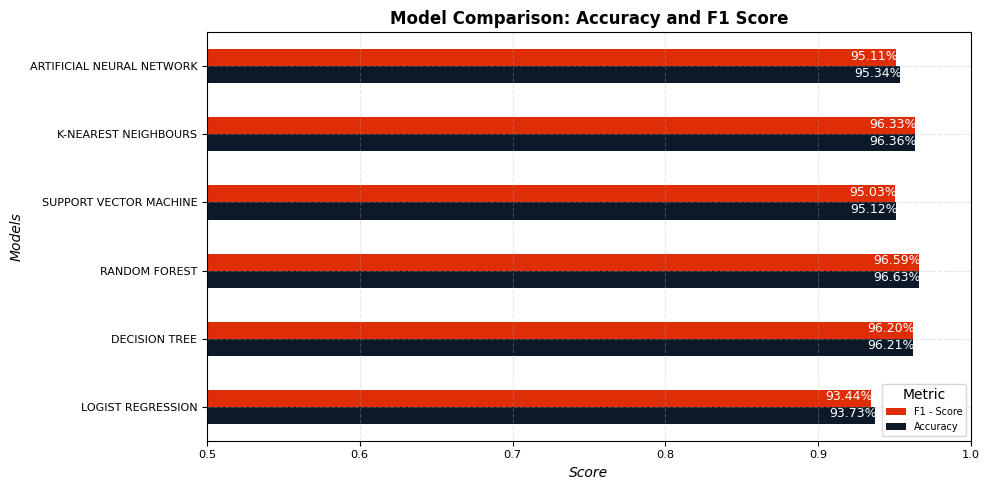

# Machine Learning Project - BIP Group

**Team Members**: Raffaele Torelli 775831 - Daniele De Robertis 787291 - Vincenzo Camerlengo 773731

## 1 - Introduction
On 1 January 2019, the Italian government introduced legislation requiring that all invoices issued between parties in Italy must be transmitted exclusively in electronic format through the "*Sistema di Interscambio*" (SDI) of the Italian "*Agenzia delle Entrate*". To simplify this process, several dedicated portals and software can be used, including BIP xTech and TeamSystem. The latter are consistently engaged in the pursuit of novel technologies and methodologies with the objective of optimising the user experience. They espouse a customer-centric approach to innovation, whereby their designers integrate the needs of individuals, technological possibilities and requirements for business success.

It is well established that certain invoice types are not subject to value-added tax and enjoy tax exemptions. The nature of these exemptions is coded using a nature code, which comprises 21 different values. Additionaly, users has to map the nature code to exemption code that represent the reason why the invoice is not subject to VAT. This task is complex and sophisticated due to the presence of 64 exemption codes, which necessitates that a nature code may correspond to more than one IvaM code. 

The objective of this project is to develop a machine learning model that is capable of predicting and suggesting the VAT exemption code (IvaM) to users based on the data on the invoice. This will enable the process to be streamlined. The following sections will engage in a comprehensive examination of the argument presented in this work.

## 2 - Methods
The company provides us with a substantial dataset, comprising approximately 130,000 invoices, each characterized by 45 related features, including very useful informations like ATECO code, document type, invoice type, VAT rate, article description, amount and many more. 

### 2.1 - Data Preprocessing
We started our analysis by visualizing the missing values in order to understand how they are distributed among the dataset:

  

  <em><small>Figure 1</small></em>

As we can see in *Figure 1*, in our dataset there were some columns with almost only null values, so we decided to drop the features that have more than 100,000 null values in order to maintain the integrity of the dataset. Subsequently, based on our knowledge, we dropped the features representing redundant information for the accomplishment of our goal, namely:
- `Unnamed: 0` represents an index.
- `Descrizione Riga` describes the object of the transaction.
- `DataDoc` is the date of the transaction.
- `RifNormativo` is the normative reference.
- `Conto`, `ContoStd` and `CoDitta` represent an internal mapping of the companies.
- `Art1` provides similar informations to variable `Valore1`.
  
In order to manage the remaining NaN values, we adopted two strategies. For every feature, except from `RF`, we filled null values with the most frequent class within the variable. Regarding the remain one, we filled null values with a new class, called 'ND'; we did it
because previous strategy is not suitable for a feature with a huge number of NaN values (approximately 79.000). Indeed, in our opinion, computing the most frequent class based on less than half occurrences would have damaged data integrity. 

Sequently, we focused on making features suitable for the prediction. 
After an exploratory analysis, we understood that the distribution of the classess within the features was strongly unbalanced: there were a few classes with many observations and many classes with very few observations. 
This is problematic because, in the case of the independent variables, encoding would create a large number of columns with nearly zero variance. Meanwhile, for the dependent variable, the model would struggle to learn how to classify invoices into exemption codes with very few observations. 
To overcome this issue, we chose a threshold, below which all classes were grouped into a new class called 'OTHER'. 
The definition of this threshold was based on the distribution of each specific variable, this is because generalizing it would have lost important information.

  

  <em><small>Figure 2</small></em>

*Figure 2* shows, as an example, how  the distibutions of the variables `Iva` and `Tdoc` changed after that rebalancing of the classes.
`Ateco` required some additional manipulations, indeed originally it was consisting in a huge number of classess, 386, unevenly distributed. This is because the ateco code divides commercial activities extremely precisely, so each class generally reports few observations.

  

  <em><small>Figure 3</small></em>

To solve this, we mantained the first two digits, which represents tha macro-category of the commercial activity, of each occurrences. Subsequently, we defined a threshold of 1000, below which all classes were grouped into a new class called 'OTHER'.
Lastly, regarding the response variable `IvaM`, we adopted a significantly lower threshold of 250, in comparison with the independent features, due to the fact that we wanted to keep an high sensitivity in the model. Indeed, an higher threshold would have meant fewer code-specific exemptions that the model is able to predict.

  

  <em><small>Figure 4</small></em>

Once the classes were balanced, we proceeded with the encoding of categorical variables, adopting binary encoding for the ones with two classes and one-hot-encoding for the remaining ones.

Afterwords, we implemented the Cramer's V method to retain only the categorical variables that have a strong association with the response one. Indeed, this method is used to assess the association between two categorical variables, based on the chi-squared, it provides a value between 0 and 1 where 0 represents no association and 1 perfect association.
After computing the metric, we defined a 0.25 threshold and for the features below it, we either included them in the class 'OTHER', if the variable was encoded, or dropped it otherwise.

### 2.2 - Models 
In this section we will explore all the statistical and machine learning models that we attempted in order to find the best performing one regarding the accomplishment of our goal. 
To asses the performance of our models, we adopted a 5 fold cross-validation, instead of a train-test split. 5 fold cross-validation is an algorithm that initially partitions the dataset into five equal-sized subsets or folds. The cross-validation process then iterates five times, each time utilizing a different fold as the validation set while the remaining four folds serve as the training data. This ensures that every data point is used for validation exactly once across the five iterations, thereby maximizing data utilization. During each iteration, the model is trained on the training folds and evaluated on the validation fold, yielding a performance metric. These performance metrics are recorded for each iteration. 
Subsequently, the average performance across all five iterations is computed to obtain a single, robust estimate of the model's performance. This approach not only reduces bias in performance estimates but also enhances the reliability and robustness of the model evaluation process. Furthermore, the use of multiple folds allows for a comprehensive comparison of different models or parameter settings, aiding in the selection of the most suitable model configuration for the given dataset.
Additionally, where possible, Optuna hyperparameter tuning was employed to discover the best parameters. We opted for this optimizer due to its computational efficiency compared to Grid Search, and its superior performance relative to Random Search. Optuna leverages Bayesian optimization techniques to navigate the hyperparameter space efficiently, prioritizing hyperparameter sets that exhibit optimal performance throughout the search process. By incorporating historical performance data, Optuna enhances the likelihood of identifying optimal hyperparameters, contributing to improved model performance.

#### 2.2.1 - Logistic Regression
The first model used is a Logistic Regression.

**Key Points**:
- Used to model the relationship between a binary dependent variable and one or more independent variables.
- Estimates the probability of occurrence of the event of interest.
- Produces coefficients indicating the effect of independent variables on the probability of success.

As we will see in next sections, despite being the 'simplest' of the models used, the metrics are still very high

#### 2.2.2 - Random Forest
Secondly we implemented a Random Forest.

**Key Points**:
- Ensemble learning method used for classification tasks.
- Builds multiple decision trees during training and outputs the class that is the mode of the classes of the individual trees.
- Each tree is trained on a random subset of the training data and features, promoting diversity among the trees.
- Handles non-linear relationships well and is robust to overfitting.

**Hyperparameters**:
- n_estimators: 117 -> number of trees in the forest.
- 'max_depth': 27 -> maximum depth of each tree. 
- 'min_samples_split': 3 -> minimum number of samples required to split an internal node.
- 'min_samples_leaf': 1 -> minimum number of samples required in a leaf.

#### 2.2.3 - Decision Tree
Then we used a Decision Tree. 

**Key Points**:
- It represents a tree-like structure where each internal node represents a feature, each branch represents a decision rule, and each leaf node represents an outcome.
- The model makes predictions by traversing the tree from the root node to a leaf node based on the features of the input data.
- Unlike Random Forest, the decision tree model is a single tree structure.

**Hyperparameters**:
- 'max_depth': 42 -> maximum depth of the decision tree.
- 'min_samples_split': 2 -> minimum number of samples required to split an internal node.
- 'min_samples_leaf': 1 -> minimum number of samples required to be at a leaf node
- 'criterion': entropy -> specifies the function used to measure the quality of a split. 'Entropy' measures the impurity of a split, aiming to maximize information gain.

#### 2.2.4 - Support Vector Machine
Proceed our exploration implementing a Support Vector Machine.

**Key Points**:
- Finds the hyperplane that best separates classes in the feature space.
- Maximizes margin between classes' nearest data points (support vectors).
- Effective in high-dimensional spaces and robust to overfitting.

The implementation of this model took a long time, so carrying out hyperparameters tuning would have been computationally extremely time-consuming and inefficient since, as we shall see in the results section, the metrics are very good anyway.

#### 2.2.5 - K-Nearest Neighbors
Then we perforder a KNN model.

**Key Points**:
- It classifies data points based on the majority class of their nearest neighbors.
- The "K" in KNN represents the number of neighbors to consider when making predictions.
- It is non-parametric and instance-based, meaning it does not make assumptions about the underlying data distribution.

**Hyperparameters**:
- 'n_neighbors': 14 -> number of neighbors considered during classification
- 'weights': 'distance' -> specifies how neighbors are weighted during prediction. Option 'distance', means that closer neighbors have more influence on the prediction.
- 'algorithm': 'auto' -> specifies the algorithm used to compute nearest neighbors. The option 'Auto' automatically selects the most suitable algorithm based on the data size and nature.
- 'leaf_size': 21 -> determines the maximum leaf size during tree construction. Is important to notice that in this case, this hyperparameter is superfluous; infact it is specific to tree-based algorithms like ball_tree or kd_tree.

#### 2.2.6 - Artificial Neural Network
Lastly, we implemented an ANN.

**Key Points**:
- Artificial Neural Networks consist of interconnected nodes (neurons) organized in layers: input layer, hidden layers, and output layer.
- Information is processed through the network by propagating forward from input to output layers.
- Neurons in each layer apply an activation function to the weighted sum of inputs to produce output.
- ANNs are powerful for complex pattern recognition and non-linear relationships in data.
- Training involves adjusting weights and biases through backpropagation using optimization algorithms like gradient descent.

**Parameters**:
- EPOCHS = 50 -> number of times the entire dataset is passed forward and backward through the neural network during training. 
- BATCH_SIZE = 128 -> number of samples processed before the model's parameters are updated. 
- NB_CLASSES = 26 -> number of classes in the classification task.
- N_SPLITS = 5 -> number of folds for cross-validation.

## 3 - Experimental Design
In this section, we present the experiments conducted to validate the effectiveness of our model for classifying exception codes.

### 3.1 - Experiment 1
The main purpose is to evaluate the performance of the proposed model’s performance based on two metrics.
- Accuracy: measures the model’s ability to correctly predict the class of an observation, it represents the ratio of correctly classified instances to the total number of instances in the dataset.
- F1 score: provides a unique metric that include both the “precision” and “recall”. Precision measures the accuracy of positive predictions made by the model. It is calculated as the ratio of true positive predictions to the total number of positive predictions made by the model. Recall measures the model's ability to identify all relevant instances in the dataset. It is calculated as the ratio of true positive predictions to the total number of actual positive instances in the dataset.

In evaluating classification models, both accuracy and the F1 score are indispensable. Accuracy provides a general overview of correctness, but in cases of class imbalance, it may be skewed by dominant classes. Meanwhile, the F1 score, by combining precision and recall, offers a balanced perspective, crucial for discerning the model's ability to correctly identify minority classes and minimize false positives/negatives. Together, these metrics ensure a comprehensive assessment, considering both overall correctness and the model's precision-recall balance, vital for real-world applicability.
### 3.2 - Experiment 2
The main purpose is to compare the models based on the chosen metrics to find the most performant one and implement it as the final solution.

## 4 - Results
This section discusses and compares the performance of different models to determine which one is the most effective for classifying exception codes.

  

  <em><small>Figure 5</small></em>

We have compared the 3 models that had the highest accuracy and F1 score values, to evaluate which model was the best according to these two parameters.
This bar chart displays that Random Forest model is the most efficient one, outperforming other models in terms of both accuracy and F1 efficiency.

In addition, we compute the confusion matrix for IvaM exemption codes. This measure, in addition to telling us how accurate the model is, gives us an idea of "how" the model gets the prediction wrong. 

  

  <em><small>Figure 6</small></em>

The confusion matrix shows that the model has a good ability to distinguish between the most common classes. The cells on the main diagonal represent the correct predictions.
We note that the cells with the darkest shades of blue are on the diagonal, indicating that the model has good accuracy for these classes. Particularly, the model shows very high accuracy for class 22.0 (1772 correct predictions out of a total of 1781) and for class 315.0 (4126 correct predictions out of a total of 4211), showing that the model performs exceptionally well for this class. 
Conversely, there are some classes like 374.0 that despite has a total of 5005 correct observations accounting for a good portion of the total, it shows also a misclassifications problem, with huge number of incorrect observations from class 300.0. This disparity showcase that lasses 374.0 and 300.0 may have similar features that confuse the model regarding  similar variables or patterns in the input data, so when the model encounters an observation of class 374.0 that has characteristics in common with class 300.0 it may misclassify it as 300.0, negatively affecting the predictions.
Despite that, the confusion matrix reveals that overall the model performs well for the majority of the classes.

### **4.6 Artificial Neural Network Results** 
Lastly, we have introduced an ANN model to learn from data and make predictions or decisions accurately and efficiently. For this particular model, we have added a third parameter, the mean loss, to evaluate its performance during training. The mean loss provides insight regarding how the model is minimizing errors between its predictions and the actual values in the training data.

- **Mean Accuracy for 5 folds**: 95.34%
- **F1 Score**: 0.9511
- **Mean loss is**: 0.1479

The mean loss provides insight regarding how the model is minimizing errors between its predictions and the actual values in the training data. By monitoring and optimizing this, we aim to improve the model's ability.

## 5 - Conclusions 

- In conclusion, we cleaned our dataset handling NaN values, ensuring the integrity and reliability of our data, moving on developing various machine learning algorithms in order to evaluate how these models effectively predicted `IvaM` exemption codes. Through accuracy, F1 Score, and mean loss metrics, we assessed the performance of each model and selected the most suitable one for predicting exemption codes. Finally, we interpreted the results to extract valuable insights and inform decision-making processes.

- While we are generally pleased with the performance of our model, we acknowledge its limitation in predicting exemption codes categorized under the class 'OTHER'. We recognize that this issue could potentially be addressed by utilizing a more balanced dataset. By ensuring that the dataset includes a sufficient representation of instances from each exemption code category, including those within the "Others" class, we can provide the model with a more comprehensive understanding of the underlying patterns and relationships. This approach may enable the model to better capture the nuances associated with predicting exemption codes across all classes, thereby enhancing its overall predictive accuracy and effectiveness.

- Overall, we are pleased with the performance of our model. Our satisfaction stems from its consistent adherence to our established quality benchmarks and its ongoing improvement towards achieving optimal predictive capabilities. This reliability instills confidence in the model's ability to make accurate predictions, contributing to our overall confidence in its effectiveness for the task at hand.

