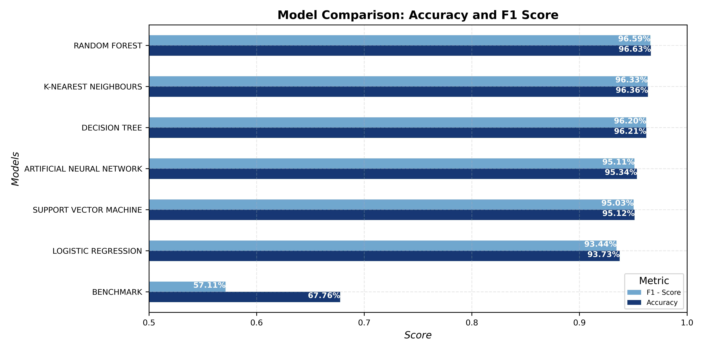

# Machine Learning Project - BIP Group

**Team Members**: Raffaele Torelli 775831 - Daniele De Robertis 787291 - Vincenzo Camerlengo 773731

## 1 - Introduction
On 1 January 2019, the Italian government introduced legislation requiring that all invoices issued between parties in Italy must be transmitted exclusively in electronic format through the "*Sistema di Interscambio*" (SDI) of the Italian "*Agenzia delle Entrate*". To simplify this process, several dedicated portals and software can be used, including BIP xTech and TeamSystem. The latter are consistently engaged in the pursuit of novel technologies and methodologies with the objective of optimising the user experience. They espouse a customer-centric approach to innovation, whereby their designers integrate the needs of individuals, technological possibilities and requirements for business success.

It is well established that certain invoice types are not subject to value-added tax and enjoy tax exemptions. The nature of these exemptions is coded using a nature code, which comprises 21 different values. Additionaly, users has to map the nature code to exemption code that represents the reason why the invoice is not subject to VAT. This task is complex and sophisticated due to the presence of 64 exemption codes, which necessitates that a nature code may correspond to more than one IvaM code. 

The objective of this project is to develop a machine learning model that is capable of predicting and suggesting the VAT exemption code (`IvaM`) to users based on the data on the invoice. This will enable the process to be streamlined. The following sections will engage in a comprehensive examination of the argument presented in this work.

## 2 - Methods
The company provides us with a substantial dataset, comprising approximately 130,000 invoices, each characterized by 45 related features, including very useful informations like ATECO code, document type, invoice type, VAT rate, article description, amount and many more. 

### 2.1 - Data Preprocessing
Our analysis started by visualizing the missing values in order to understand how they are distributed among the dataset:

  

  <em><small>Figure 1</small></em>

As it is shown in *Figure 1*, in our dataset there were some columns with almost only null values, so the features with more than 100,000 null values have been dropped in order to maintain the integrity of the dataset. Subsequently, based on our knowledge, also the features representing redundant information for the accomplishment of our goal, have been excluded from our dataset. Namely:
- `Unnamed: 0` represents an index.
- `Descrizione Riga` describes the object of the transaction.
- `DataDoc` is the date of the transaction.
- `RifNormativo` is the normative reference.
- `Conto`, `ContoStd` and `CoDitta` represent an internal mapping of the companies.
- `Art1` provides similar informations to variable `Valore1`.
  
In order to manage the remaining NaN values, two strategies have been adopted. For every feature, except from `RF`, null values were filled with the most frequent class within the variable. Regarding the remaining one, null values were filled with a new class, called 'ND'; since addressing null values with the previous strategy is not suitable for features with a large number of missing values (approximately 79.000). Indeed, in our opinion, computing the most frequent class based on less than half of the occurrences would have damaged data integrity. 

Subsequently, features manipulation was needed in order to make them suitable for the prediction. 
After an exploratory analysis, it was evidend that the distribution of the classes within the features was strongly unbalanced: there were a few classes with many observations and many classes with very few observations. 
This is problematic because, in the case of the independent variables, the encoding would create a large number of columns with nearly zero variance. Meanwhile, for the dependent variable, the model would struggle to learn how to classify invoices into exemption codes with very few observations. 
To overcome this issue, it has been chosen a threshold, below which all classes were grouped into a new class called 'OTHER'. 
The definition of this threshold was based on the distribution of each specific variable, since by generalizing a lot of information would have been lost.

  

  <em><small>Figure 2</small></em>

*Figure 2* shows, as an example, how  the distibutions of the variables `Iva` and `Tdoc` changed after the rebalancing of the classes.

`Ateco` required some additional manipulations, indeed originally it was consisting of a huge number of classes, 386, unevenly distributed. 

  

  <em><small>Figure 3</small></em>

To solve this, only the first two digits of each occurrence are taken into account, beacuse they represent tha macro-category of the commercial activity. Subsequently, threshold of 1000 was defined, below which all classes were grouped into a new class called 'OTHER'.

Lastly, regarding the response variable `IvaM`, a lower threshold of 250 was adopted. The rationale behind the smaller size of the threshold in comparison to those employed for independent features is to ensure the maximum possible prediction of exemption codes. Indeed, an higher threshold would have meant fewer code-specific exemptions that the model is able to predict.

  

  <em><small>Figure 4</small></em>

Once the classes were balanced, to make the features adequate and be able to fit them in the model,was adopted binary encoding for the ones with two classes and one-hot-encoding for the remaining ones.

Afterwords, the Cramer's V method was implemented to retain only the categorical variables that have a strong association with the response. Indeed, this method, which is based on the chi-squared, is used to assess the association between two categorical variables by providing a value between 0 and 1: where 0 represents no association and 1 perfect association.
After computing the metric, a 0.25 threshold was set and the features below it were either included in the class 'OTHER', if the variable was encoded, or dropped it otherwise.

### 2.2 - Models 
This section analyzes all the statistical and machine learning models that were attempted in order to accomplish our goal. 
To asses the performance of our models, a 5 fold cross-validation was adopted, instead of a train-test split. 5 fold cross-validation is an algorithm that initially partitions the dataset into five equal-sized subsets or folds. The cross-validation process then iterates five times, each time utilizing a different fold as the validation set while the remaining four folds serve as the training data. This ensures that every data point is used for validation exactly once across the five iterations, thereby maximizing data utilization. During each iteration, the model is trained on the training folds and evaluated on the validation fold, yielding a performance metric. These performance metrics are recorded for each iteration. 
Subsequently, the average performance across all five iterations is computed to obtain a single, robust estimate of the model's performance. This approach not only reduces bias in performance estimates but also enhances the reliability and robustness of the model evaluation process. Furthermore, the use of multiple folds allows for a comprehensive comparison of different models or parameter settings, aiding in the selection of the most suitable model configuration for the given dataset.
Additionally, where possible, Optuna hyperparameter tuning was employed to discover the best parameters. This optimizer was chosen due to its computational efficiency compared to Grid Search, and its superior performance relative to Random Search. Optuna leverages Bayesian optimization techniques to navigate the hyperparameter space efficiently, prioritizing hyperparameter sets that exhibit optimal performance throughout the search process. By incorporating historical performance data, Optuna enhances the likelihood of identifying optimal hyperparameters, contributing to improved model performance.

#### 2.2.1 - Logistic Regression
The first model used is a Logistic Regression.
Logistic regression determines the probability of an event. Conventionally, the event is represented as a categorical dependent variable. The probability of the event is expressed using the sigmoid (or “logit”) function[^1]:

$$
P(\hat{Y} = 1 \mid X = x) = \frac{1}{1 + e^{-(b + \mathbf{w}^T \mathbf{x})}}
$$

where $\mathbf{w} = \{w_1, w_2, \ldots, w_n\}$ are the weights and $b$ is the bias term. Logistic regression is used in classification problems and the coefficients are estimated using either the maximum likelihood estimator or stochastic gradient descent. 

As the following section will display, despite being the 'simplest' of the models used, the metrics are still very high.

[^1]:Kapoor, Amita, Antonio Gulli, and Sujit Pal. "Deep Learning with TensorFlow and Keras–3rd edition." Small (2017)

#### 2.2.2 - Random Forest
Secondly a Random Forest was implemented.
Random Forest is a statistical or machine-learning algorithm for prediction. Random decision forests easily adapt to nonlinearities found in the data and therefore tend to predict better than linear regression. More specifically, ensemble learning algorithms like random forests are well suited for medium to large datasets. The tree-based models form the building blocks of the random forest algorithm. A tree-based model involves recursively partitioning the given dataset into two groups based on a certain criterion until a predetermined stopping condition is met. At the bottom of decision trees are so-called leaf nodes or leaves[^2].

**Hyperparameters**:
- n_estimators: 117 -> number of trees in the forest.
- 'max_depth': 27 -> maximum depth of each tree. 
- 'min_samples_split': 3 -> minimum number of samples required to split an internal node.
- 'min_samples_leaf': 1 -> minimum number of samples required in a leaf.

[^2]:Schonlau, Matthias, and Rosie Yuyan Zou. "The random forest algorithm for statistical learning." The Stata Journal 20.1 (2020)

#### 2.2.3 - Decision Tree
Then a Decision Tree was attempted. 
Decision trees can be applied to both regression and classification problems. A decision tree is a classifier expressed as a recursive partition of the instance space. The decision tree consists of nodes that form a rooted tree, meaning it is a directed tree with a node called “root” that has no incoming edges. All other nodes have exactly one incoming edge. A node with outgoing edges is called an internal or test node. All other nodes are called leaves, also known as terminal or decision nodes. In a decision tree, each internal node splits the instance space into two or more sub-spaces according to a certain discrete function of the input attributes values. In the simplest and most frequent case, each test considers a single attribute, such that the instance space is partitioned according to the attribute’s value. Each leaf is assigned to one class representing the most appropriate target value[^3].

**Hyperparameters**:
- 'max_depth': 42 -> maximum depth of the decision tree.
- 'min_samples_split': 2 -> minimum number of samples required to split an internal node.
- 'min_samples_leaf': 1 -> minimum number of samples required to be at a leaf node
- 'criterion': entropy -> specifies the function used to measure the quality of a split. 'Entropy' measures the impurity of a split, aiming to maximize information gain.

[^3]:Rokach, Lior, and Oded Maimon. "Decision trees." Data mining and knowledge discovery handbook (2005): 165-192.

#### 2.2.4 - Support Vector Machine
Proceed our exploration implementing a Support Vector Machine.
The support vector machine (SVM) is an extension of the support vector classifier that results from enlarging the feature space in a specific way, using kernels. They allow to enlarge feature space in order to accommodate a non-linear boundary between the classes[^4].
In linear classification, SVM map input vector to a higher dimensional space where a maximal separating hyperplane is constructed. Two parallel hyperplanes are constructed on each side of the hyperplane that separate the data. The separating hyperplane is the hyperplane that maximize the distance between the two parallel hyperplanes. An assumption is made that the larger the margin or distance between these parallel hyperplanes the better the generalization error of the classifier will be. In the case of nonlinear dividing line, rather than fitting nonlinear curves to the data, SVM handles this by using a kernel function to map the data into a different space where a hyperplane can be used to do the separation[^5].

Since the implementation of this model took a considerable time, carrying out hyperparameters tuning would have been computationally extremely time-consuming and inefficient since, as is clear in the results section, the metrics are very good anyway.

[^4]:James, Gareth, et al. An introduction to statistical learning. Vol. 112. New York: springer, 2013.
[^5]:Bhavsar, Himani, and Mahesh H. Panchal. "A review on support vector machine for data classification." International Journal of Advanced Research in Computer Engineering & Technology (IJARCET) 1.10 (2012): 185-189.

#### 2.2.5 - K-Nearest Neighbors
Then a KNN model was performed.
Nearest neighbors classification, also known KNN, is based on the idea that the nearest patterns to a target pattern $x$ , for which we seek the label, deliver useful label information. KNN assigns the class label of the majority of the K-nearest patterns in data space. For this sake, we have to be able to define a similarity measure in data space. In the set of real numbers ℝ, it is reasonable to employ the Euclidean distance. The choice of $K$ defines the locality of KNN. For $K = 1$, little neighborhoods arise in regions, where patterns from different classes are scattered. For larger neighborhood sizes, e.g. $K = 20$, patterns with labels in the minority are ignored[^6].

**Hyperparameters**:
- 'n_neighbors': 14 -> number of neighbors considered during classification
- 'weights': 'distance' -> specifies how neighbors are weighted during prediction. Option 'distance', means that closer neighbors have more influence on the prediction.
- 'algorithm': 'auto' -> specifies the algorithm used to compute nearest neighbors. The option 'Auto' automatically selects the most suitable algorithm based on the data size and nature.
- 'leaf_size': 21 -> determines the maximum leaf size during tree construction. Is important to notice that in this case, this hyperparameter is superfluous; infact it is specific to tree-based algorithms like ball_tree or kd_tree.

[^6]:Peterson, Leif E. "K-nearest neighbor." Scholarpedia 4.2 (2009): 1883.

#### 2.2.6 - Artificial Neural Network
Lastly, an ANN was implemented.
Artificial neural networks is a popular machine learning technique inspired by the biological neural network in the human brain. Feed forward neural networks are a common type of ANN which sends the weight values of each artificial neuron as output to the next layer after processing with inputs from neurons in the previous layer. An important class of feed forward neural network is Multilayer Perceptron (MLP). The back propagation algorithm is the most widely used MLP training technique. This changes the weights between neurons to minimize the error. This model is quite good in learning patterns. It can easily adapt to new values in the data, but the system can show a slow convergence and has the risk of a local optimum. The training data set was used to determine ANN neuron and bias weight values. Training was repeated to obtain the lowest level of error by changing the number of neurons and the epoch number. Then, the trained algorithm was applied on the test data set[^7].

**Parameters**:
- EPOCHS = 50 -> number of times the entire dataset is passed forward and backward through the neural network during training. 
- BATCH_SIZE = 128 -> number of samples processed before the model's parameters are updated. 
- NB_CLASSES = 26 -> number of classes in the classification task.
- N_SPLITS = 5 -> number of folds for cross-validation.

[^7]:Saritas, Mucahid Mustafa, and Ali Yasar. "Performance analysis of ANN and Naive Bayes classification algorithm for data classification." International journal of intelligent systems and applications in engineering 7.2 (2019): 88-91.

## 3 - Experimental Design
In this section, the experiments conducted to validate the effectiveness of our model for classifying exception codes are presented.

### 3.1 - Models Evaluation 
The main purpose is to evaluate the performance of the proposed models based on two metrics and on the comparison with the benchmark.
- Accuracy: measures the model’s ability to correctly predict the class of an observation, it represents the ratio of correctly classified instances to the total number of instances in the dataset.
- F1 score: provides a unique metric that include both the “precision” and “recall”. Precision measures the accuracy of positive predictions made by the model. It is calculated as the ratio of true positive predictions to the total number of positive predictions made by the model. Recall measures the model's ability to identify all relevant instances in the dataset. It is calculated as the ratio of true positive predictions to the total number of actual positive instances in the dataset.
- Benchmark: consists in a logistic regression with only the nature code (`Iva`) as independent variable.

In evaluating classification models, both accuracy and the F1 score are indispensable. Accuracy provides a general overview of correctness, but in cases of class imbalance, it may be skewed by dominant classes. Meanwhile, the F1 score, by combining precision and recall, offers a balanced perspective, crucial for discerning the model's ability to correctly identify minority classes and minimize false positives/negatives. Together, these metrics ensure a comprehensive assessment, considering both overall correctness and the model's precision-recall balance.
While comparing our models with the benchmark enables us to understand how effectively they capture complex relationships in the data, especially in contrast to simpler models.

### 3.2 - Models Comparison
The main purpose is to compare the models based on the chosen metrics to find the most performant one and implement it as the final solution.

## 4 - Results
This section discusses and compares the performance of different models to determine which one is the most effective for classifying exception codes.

  

  <em><small>Figure 5</small></em>

This bar chart compares the 6 models and the benchmark to evaluate which model has the highest accuracy and F1 score values. The result turned out as all the models’ metrics far outweigh the benchmark ones, demonstrating a significant improvement over standard performance expectation. As it is clear from the graph, the Random Forest model is the most performing one, exceeding other models in terms of both accuracy and F1 efficiency, respectively 96.63% and 96.59%, probably due its ability to handle a large variety of data features and its robustness against overfitting. However, also the other models performed really accurate prediction; indeed, the Logistic Regression which is the worst one, accomplishes an accuracy and an F1 Score slightly lower than the Random Forest ones. 

In order to display how our best model classify each occurrency, it has been set up a confusion matrix. A confusion matrix compares the predictions to the true classes. Elements on the diagonal of the matrix represent classes correctly predicted, while off-diagonal elements represent misclassified classes[^4].

  

  <em><small>Figure 6</small></em>

The confusion matrix shows that the model has a good ability to distinguish between the most common classes. Particularly, the model displays very high accuracy for class 22.0 (1772 correct predictions out of a total of 1781) and for class 315.0 (4126 correct predictions out of a total of 4211). Conversely, there are some classes like 374.0 that despite has a total of 5005 correct observations accounting for a good portion of the total, it also shows a misclassifications problem, with huge number of incorrect observations from class 300.0. This disparity showcases that lasses 374.0 and 300.0 may have similar features that confuse the model regarding similar variables or patterns in the input data, so when the model encounters an observation of class 374.0 that has characteristics in common with class 300.0 it may misclassify it as 300.0, negatively affecting the predictions. Despite that, the confusion matrix reveals that overall the model performs well for the majority of the classes.

## 5 - Conclusions 

In conclusion, summarizing all the analysis process, the dataset was cleaned by handling NaN values, ensuring the integrity and reliability of our data, moving on developing various machine learning algorithms in order to evaluate how these models effectively predicted IvaM exemption codes. Through accuracy, F1 Score, and mean loss metrics, it was assessed the performance of each model and selected the most suitable one for predicting exemption codes. Finally, the results were interpreted to extract valuable insights and inform decision-making processes.

While generally the performance of the models was extremely satisfying, it was evident their limitation in predicting exemption codes categorized under the class 'OTHER'. This issue could potentially be addressed by utilizing a more balanced dataset. By ensuring that the dataset includes a sufficient representation of instances from each exemption code category, including those within the "Others" class, it can provide the model with a more comprehensive understanding of the underlying patterns and relationships. This approach may enable the model to better capture the nuances associated with predicting exemption codes across all classes, thereby enhancing its overall predictive accuracy and effectiveness.

Overall, the performance of our model was appreciably adequate. This satisfaction stems from its consistent adherence to established quality benchmarks and its ongoing improvement towards achieving optimal predictive capabilities. This reliability instils confidence in the model's ability to make accurate predictions, contributing to overall confidence in its effectiveness for the task at hand.

